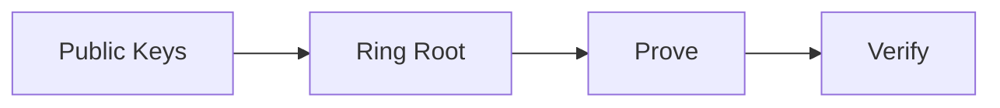

# Ring VRF API Reference

The `RingVRF` class implements an anonymous membership VRF using ring signatures and KZG polynomial commitments. It proves membership in a ring of public keys without revealing which member created the proof.

## Import

```python
from dot_ring import RingVRF, Bandersnatch
```

:::caution Curve Support
Ring VRF currently **only supports the Bandersnatch curve**. Other curves will raise an error.
:::

## Concept

Ring VRF allows a member of a set (ring) to prove they belong to that set **without revealing which member they are**:

```
Ring = {PK₁, PK₂, PK₃, ..., PKₙ}

RingVRF.prove(...) → Proof that "I am one of these keys" 
                     without revealing which one
```

## Workflow



1. **Collect public keys** - Gather all ring members' public keys
2. **Build ring root** - Create a KZG commitment to the ring
3. **Generate proof** - Prove membership anonymously
4. **Verify** - Check proof against the ring root

## Class Methods

### `construct_ring_root(keys_list)`

Build a ring commitment from a list of public keys.

**Parameters:**

| Name | Type | Description |
|------|------|-------------|
| `keys_list` | `list[bytes]` | List of serialized public keys |

**Returns:** `RingRoot` object

**Example:**

```python
from dot_ring import RingVRF, Bandersnatch

# List of public keys
keys_list = [pk1, pk2, pk3, pk4, pk5, pk6, pk7, pk8]

ring_root = RingVRF[Bandersnatch].construct_ring_root(keys_list)
```

---

### `prove(alpha, additional_data, secret_key, public_key, keys_list)`

Generate an anonymous ring membership proof.

**Parameters:**

| Name | Type | Description |
|------|------|-------------|
| `alpha` | `bytes` | Input data to sign |
| `additional_data` | `bytes` | Optional additional data |
| `secret_key` | `bytes` | Your 32-byte secret key |
| `public_key` | `bytes` | Your serialized public key |
| `keys_list` | `list[bytes]` | All ring members' serialized public keys |

**Returns:** `RingProof` object

**Example:**

```python
proof = RingVRF[Bandersnatch].prove(
    alpha=b'block-selection',
    additional_data=b'',
    secret_key=my_secret_key,
    public_key=my_public_key,
    keys_list=ring_keys
)
```

---

### `get_public_key(secret_key)`

Derive the public key from a secret key.

**Parameters:**

| Name | Type | Description |
|------|------|-------------|
| `secret_key` | `bytes` | 32-byte secret key |

**Returns:** `bytes` - The serialized public key

---

### `parse_keys(keys_bytes)`

Parse concatenated public key bytes into a list of points.

**Parameters:**

| Name | Type | Description |
|------|------|-------------|
| `keys_bytes` | `bytes` | Concatenated serialized public keys |

**Returns:** `list[bytes]` - List of serialized public keys

**Example:**

```python
# 8 keys × 32 bytes = 256 bytes total
keys_hex = "7b32d917d5aa771d493c47b0e096886827cd056c82dbdba19e60baa8b2c60313..."
keys_bytes = bytes.fromhex(keys_hex)
keys_list = RingVRF[Bandersnatch].parse_keys(keys_bytes)
```

---

### `from_bytes(proof_bytes)`

Deserialize a proof from bytes.

**Parameters:**

| Name | Type | Description |
|------|------|-------------|
| `proof_bytes` | `bytes` | Serialized ring proof |

**Returns:** `RingProof` object

---

## RingRoot Object

The ring commitment returned by `construct_ring_root()`.

### Attributes

| Attribute | Type | Description |
|-----------|------|-------------|
| `px` | `Column` | X-coordinate polynomial commitment |
| `py` | `Column` | Y-coordinate polynomial commitment |
| `s` | `Column` | Selector polynomial commitment |

### Methods

#### `to_bytes()`

Serialize the ring root to bytes.

**Returns:** `bytes` - 144 bytes (3 × 48-byte G1 points)

#### `from_bytes(data)`

Deserialize a ring root from bytes.

**Returns:** `RingRoot` object

---

## RingProof Object

The proof object returned by `prove()`.

### Attributes

| Attribute | Type | Description |
|-----------|------|-------------|
| `pedersen_proof` | `PedersenVRF` | Embedded Pedersen VRF proof |
| `c_b` | `Column` | Bits column commitment |
| `c_accip` | `Column` | Inner product accumulator commitment |
| `c_accx` | `Column` | X-coordinate accumulator commitment |
| `c_accy` | `Column` | Y-coordinate accumulator commitment |
| `px_zeta`, `py_zeta`, etc. | `int` | Polynomial evaluations at ζ |
| `c_q` | `Column` | Quotient polynomial commitment |
| `l_zeta_omega` | `int` | Linearization evaluation |
| `open_agg_zeta` | `Opening` | Aggregate opening proof at ζ |
| `open_l_zeta_omega` | `Opening` | Linearization opening proof at ζω |

### Methods

#### `verify(alpha, additional_data, ring_root)`

Verify the anonymous membership proof.

**Parameters:**

| Name | Type | Description |
|------|------|-------------|
| `alpha` | `bytes` | Original input data |
| `additional_data` | `bytes` | Original additional data |
| `ring_root` | `RingRoot` | Ring commitment |

**Returns:** `bool` - `True` if valid

**Example:**

```python
is_valid = proof.verify(alpha, additional_data, ring_root)
```

---

#### `to_bytes()`

Serialize the proof to bytes.

**Returns:** `bytes` - Serialized ring proof

---

## Complete Example

```python
from dot_ring import RingVRF, Bandersnatch
import secrets

# Create ring members
ring_keys = []
for _ in range(8):
    sk = secrets.token_bytes(32)
    pk = RingVRF[Bandersnatch].get_public_key(sk)
    ring_keys.append(pk)

# Your keys (you're the first member)
my_secret_key = secrets.token_bytes(32)
my_public_key = RingVRF[Bandersnatch].get_public_key(my_secret_key)
ring_keys[0] = my_public_key  # Replace first with yours

# Build ring commitment
ring_root = RingVRF[Bandersnatch].construct_ring_root(ring_keys)

# Generate anonymous proof
alpha = b'validator-selection-round-42'
additional_data = b''

proof = RingVRF[Bandersnatch].prove(
    alpha, additional_data, my_secret_key, my_public_key, ring_keys
)

# Verify - verifier only knows ring_root, not which member signed
is_valid = proof.verify(alpha, additional_data, ring_root)
assert is_valid, "Ring proof verification failed!"

# Serialization
proof_bytes = proof.to_bytes()
print(f"Proof size: {len(proof_bytes)} bytes")  # ~784 bytes

ring_root_bytes = ring_root.to_bytes()
print(f"Ring root size: {len(ring_root_bytes)} bytes")  # 144 bytes
```

## Ring Size

~784 bytes

Proof size is constant regardless of ring size!

## Technical Details

Ring VRF uses:
- **KZG Polynomial Commitments** - Efficient constant-size proofs
- **BLS12-381 Pairings** - For KZG verification
- **Plonk-style Constraints** - For ring membership proving
- **Fiat-Shamir Transform** - For non-interactivity

## Security Considerations

1. **Ring Membership** - Your public key must be in the ring
2. **Ring Size** - Larger rings provide better anonymity
3. **Ring Reuse** - Same ring can be used for multiple proofs
4. **SRS Trusted Setup** - Uses BLS12-381 powers of tau ceremony
